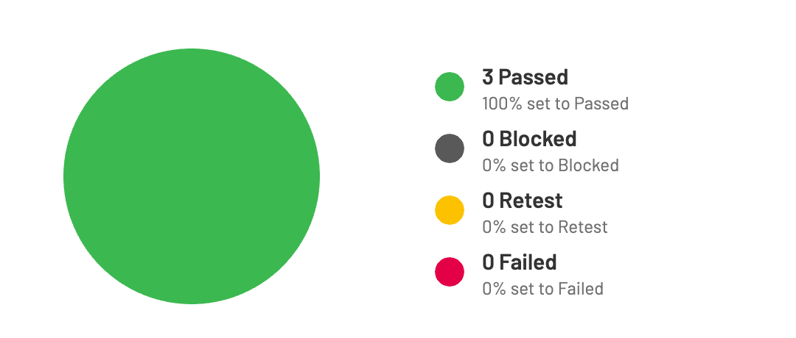

# Mostly AI Home Assignment

Welcome to the readme file for the test automation project I've completed for the  Mostly AI Company's home assignment. This document provides an overview of the project structure, tools used, and how to run the automated tests.

## Project Overview

This project focuses on automating test scenarios for Mostly AI Company's website using the Cypress testing framework. The key features and tools used in this project include:

- **Cypress**: A popular end-to-end testing framework that allows you to write and run tests for web applications.

- **Typescript**: As a programming language.

- **TestRail Integration**: TestRail is a test case management tool that helps organize, manage, and track test cases, reports results.

- **Page Object Model (POM)**: A design pattern that organizes the test automation framework by creating separate classes for each page of the application.

- **Custom Commands**: Custom commands in Cypress allow you to create reusable functions for repetitive actions, improving test script maintainability.

- **Global Test Data**: Test data is fetched globally from fixtures, ensuring consistent and reliable data for tests.

- **Selectors Constants**: Constants for selectors enhance code readability and maintainability by centralizing element locators.

- **Prettier**:To achieve clean and consistent code, it is utilized [Prettier] a code formatting tool that automatically enforces a consistent code style across the codebase.

## Project Structure

The project follows a structured organization to improve maintainability and readability. Here's an overview of the main components:

- `cypress/`
  - `fixture/`: Contains JSON files with test data that can be used in tests.
  - `e2e/`: Holds test script files organized by feature or module.
  - `support/`: Contains global configuration and utility functions.
    - `commands.ts`: Defines custom commands for repetitive actions.
    - `selectors.ts`: Contains constants for element selectors.
    - `e2e.ts`: Contains imports.
    - `index.d.ts`: Contains declaration of custom commands.

- `cypress.config.js`: Cypress configuration file.

## How to Run the Tests

Follow these steps to run the automated tests:

1. **Prerequisites**: Ensure you have Node.js and npm (Node Package Manager) installed on your system.

2. **Clone the Repository**: Clone the repository to your local machine.

3. **Navigate to the Project Directory**: Open your terminal/command prompt and navigate to the project directory.

4. **Install Dependencies**: Run the following command to install the required dependencies:

   ```
   npm install
   ```

5. **Run Tests**: To run the tests, use the following command:

   ```
   npx cypress open
   ```

   This command will open the Cypress Test Runner, where you can select the test script you want to run. You can also run the tests in headless mode using the following command:

   ```
   npx cypress run
   ```

6. **View Test Results**: After the tests run, you can view the test results in the Cypress Test Runner. Additionally, test results is integrated with TestRail for more comprehensive tracking.

## Access Information

### Domain Link

The TestRail instance can be accessed using the following domain link:

- Domain: [testrail-domain](https://mmoosstt.testrail.io)
  
### Login Credentials

Please use the following credentials to log in:

- Username: `tangiev1990@durablecanada.com` (Its by faker)
- Password: `Test123.`


